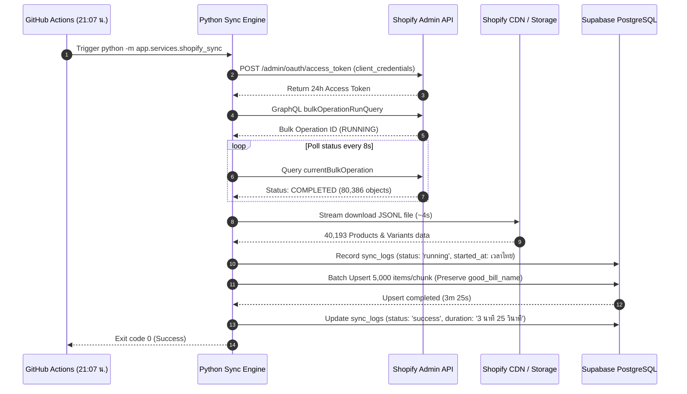

# Quotation Image Automation & Catalog Sync System
## เอกสารสถาปัตยกรรมระบบ, โครงสร้างข้อมูล และ Tech Stack ฉบับสมบูรณ์

---

## 1. ภาพรวมระบบ (System Overview)

ระบบ **Quotation Image Automation & Catalog Sync** เป็นระบบจัดการและประมวลผลใบเสนอราคา (Quotation PDF) พร้อมระบบซิงค์ฐานข้อมูลสินค้าแคตตาล็อกขนาดใหญ่ (40,000+ รายการ) จาก Shopify เข้าสู่ Supabase PostgreSQL โดยอัตโนมัติ

### วัตถุประสงค์หลักของระบบ:
1. **Quotation Image Web Studio**: ช่วยให้ฝ่ายขายและฝ่ายต้นทุนสามารถอัปโหลดใบเสนอราคา (PDF) ตรวจจับตำแหน่งสินค้าอัตโนมัติ แทรกรูปภาพสินค้าจากแคตตาล็อกได้อย่างแม่นยำ ปรับขนาด/ย้าย/ครอบตัด (Crop) แบบ Canva สไตล์ จัดการประวัติ Undo/Redo และดาวน์โหลด PDF คุณภาพสูงระดับเวกเตอร์ (Vector-perfect, Zero rasterization)
2. **Automated Catalog Synchronization**: ดึงข้อมูลสินค้าล่าสุดจาก Shopify ผ่าน GraphQL Bulk Operations API นำมาอัปเดตลงตาราง `products` บน Supabase ทุกวันเวลา **21:07 น.** (เวลาไทย) พร้อมผูกชื่อสินค้าในบิล (`GoodBillName`) จาก Google Sheets / ข้อมูลเดิมโดยไม่สูญหาย

---

## 2. Tech Stack ทั้งหมดที่ใช้ในโครงการ (Full Tech Stack Breakdown)

ระบบถูกออกแบบตามหลัก **Modern Decoupled Architecture** แยกส่วน Frontend, Backend API, และ Database อย่างชัดเจน เพื่อความยืดหยุ่น ประสิทธิภาพสูงสุด และบำรุงรักษาง่าย

```text
┌────────────────────────────────────────────────────────────────────────┐
│                        WEB CLIENT (Next.js 16)                         │
│   TypeScript • Tailwind CSS • Lucide Icons • PDF.js • Canvas 2D Studio  │
│                   Hosted on: Vercel (Edge Network)                     │
└───────────────────────────────────┬────────────────────────────────────┘
                                    │ Reverse Proxy (/api/*)
                                    ▼
┌────────────────────────────────────────────────────────────────────────┐
│                        BACKEND API (FastAPI)                           │
│   Python 3.10+ • PyMuPDF (fitz) • Pillow • HTTPX • Psycopg 3 • Pydantic │
│                   Hosted on: Render (Cloud Web Service)                │
└──────────────┬────────────────────┬────────────────────┬───────────────┘
               │                    │                    │
               ▼                    ▼                    ▼
┌──────────────────────┐  ┌──────────────────┐  ┌────────────────────────┐
│  Supabase PostgreSQL │  │   Shopify API    │  │ GitHub Actions Cron    │
│  - products (40k+)   │  │   - GraphQL Bulk │  │ - Daily Sync @ 21:07   │
│  - sync_logs         │  │   - OAuth 2.0    │  │ - Automated CI/CD      │
│  - saved_mappings    │  │   - CDN Images   │  │                        │
└──────────────────────┘  └──────────────────┘  └────────────────────────┘
```

### 2.1 Web Frontend (Quotation Web Studio)
* **Framework**: [Next.js 16](https://nextjs.org/) (App Router Architecture, React 19 ready)
* **Build Engine / Bundler**: Turbopack (High-performance incremental compiler)
* **Language**: TypeScript 5 (Strict type-checking)
* **Styling**: Tailwind CSS (Custom Modern Design System, Clean Dark/Light UI)
* **Icons**: Lucide React
* **PDF Rendering & Interaction**:
  * [Mozilla PDF.js](https://mozilla.github.io/pdf.js/) (`pdfjs-dist`) สำหรับเรนเดอร์หน้ากระดาษ PDF แบบ Client-side
  * HTML5 Canvas 2D API สำหรับการ Drag & Drop, Resize Handles และ Canva-style Image Cropping/Zooming
* **HTTP Client**: Native Fetch API พร้อม Next.js Rewrites สำหรับป้องกันปัญหา Third-party Cookies / CORS

### 2.2 Backend API & Core PDF Engine
* **Language**: Python 3.10+
* **Web Framework**: [FastAPI](https://fastapi.tiangolo.com/) (Asynchronous High-performance REST API)
* **ASGI Server**: Uvicorn (Lightning-fast ASGI server)
* **Data Validation**: Pydantic v2 (Request/Response data models & schema enforcement)
* **PDF Processing Engine**:
  * [PyMuPDF](https://pymupdf.readthedocs.io/) (`fitz` v1.24+): เครื่องมืออ่านโครงสร้างเวกเตอร์ ค้นหาเส้นขอบตาราง (Boundary Detection) ตรวจจับการชนข้อความ (Text Collision Avoidance) และแทรกรูปภาพเวกเตอร์โดยไม่ลดทอนคุณภาพเอกสารเดิม (Zero-rasterization)
* **Image Processing**: Pillow (PIL) สำหรับแปลง/ปรับขนาดรูปภาพ, คำนวณ Aspect Ratio และ Crop Geometry
* **HTTP & Network Client**: HTTPX (Asynchronous & Synchronous HTTP client พร้อม Connection Pooling และ Timeout handling)
* **Database Driver**: [Psycopg 3](https://www.psycopg.org/psycopg3/) (PostgreSQL native binary driver with connection pooling & batch upsert optimization)
* **State & History Management**: Custom In-Memory & Session Stack สำหรับ Undo/Redo (Ctrl+Z / Ctrl+Y)

### 2.3 Database & Cloud Storage
* **Database Engine**: [Supabase](https://supabase.com/) / PostgreSQL 15+
* **Connection Pooling**: Supabase Transaction Pooler (Supavisor, AWS ap-south-1)
* **Data Volume**: จัดการข้อมูลสินค้ากว่า **40,190+ รายการ** ได้อย่างรวดเร็วด้วย B-Tree Indexes
* **Image CDN**: Shopify CDN (`cdn.shopify.com`) รองรับพารามิเตอร์ `&width=200` ช่วยลดขนาดรูปภาพที่ดาวน์โหลดลงกว่า 80%

### 2.4 External Integrations & APIs
* **Shopify Admin API**:
  * **Version**: `2025-01`
  * **GraphQL Bulk Operations API**: ดึงข้อมูลสินค้าและ Variant ทั้งหมด (~80,000+ objects) ภายในคำขอเดียวแบบ Asynchronous Streaming JSONL
  * **OAuth 2.0 Authentication**: ระบบสร้าง Token อัตโนมัติด้วยสิทธิ์ `client_credentials` อายุ 24 ชั่วโมง โดยไม่ต้องใช้คนหมุนเวียน Token
* **Google Apps Script & Google Sheets**:
  * สคริปต์ [syncGoodBillNames.js](file:///syncGoodBillNames.js) สำหรับดึง `GoodBillName` จาก Google Sheets (`'Main Product'` ใน Spreadsheet `1Z48qT3LXYozhlh_ZBHzn9e4x1kfX_bOLHQtaksj-ZXU`) เข้าสู่ Supabase

### 2.5 Automation & CI/CD
* **GitHub Actions**:
  * **Daily Cron Scheduler**: รันอัตโนมัติทุกวันเวลา **21:07 น. (เวลาไทย)** หรือ `14:07 UTC` ผ่าน [.github/workflows/shopify-sync.yml](file:///.github/workflows/shopify-sync.yml)
  * **Manual Trigger**: รองรับการกดรันด้วยมือ (`workflow_dispatch`)
  * **Secret Management**: จัดเก็บ `DATABASE_URL`, `SHOPIFY_CLIENT_SECRET`, `SHOPIFY_CLIENT_ID` ผ่าน GitHub Encrypted Secrets

### 2.6 Hosting & Cloud Infrastructure
* **Frontend Hosting**: [Vercel](https://vercel.com/) (Edge Network CDN)
  * Production URL: `https://quotation-image-system.vercel.app`
* **Backend Hosting**: [Render](https://render.com/) (Docker / Native Python Web Service)
  * Production API: `https://quotation-api-h4ta.onrender.com`

### 2.7 Quality Assurance & Testing
* **Backend Tests**: Python `unittest` ครอบคลุม Unit Tests และ Integration Tests ทั้งหมด **58 ชุดทดสอบ (100% Passing)**
* **Frontend Tests**: Playwright E2E Test Suites ตรวจสอบการอัปโหลด, Drag-and-drop, Crop, และ Generate PDF

---

## 3. สถาปัตยกรรมระบบและการไหลของข้อมูล (Data Flow Architecture)

### 3.1 วงจรการ Sync แคตตาล็อกสินค้า (Daily Shopify Sync Flow)



---

## 4. โครงสร้างฐานข้อมูล Supabase (Database Schema)

### 4.1 ตาราง `products` (แคตตาล็อกสินค้าหลัก)
เก็บเฉพาะข้อมูลที่จำเป็นและถูกใช้งานจริงตาม Business Logic:

| ชื่อคอลัมน์ (Column) | ชนิดข้อมูล (Type) | คำอธิบาย (Description) |
|:---|:---|:---|
| **`id`** | `bigint` (PK) | รหัสไอดีลำดับแถว (Auto Increment) |
| **`good_id`** | `text` (Unique) | รหัส GoodID จาก Shopify Custom Metafield (ใช้เป็น Key อ้างอิงหลัก) |
| **`sku`** | `text` | รหัส Variant SKU สินค้า |
| **`winspeed`** | `text` | รหัสสินค้า Winspeed สำหรับจับคู่ใบเสนอราคา |
| **`model`** | `text` | ชื่อรุ่นสินค้า (สกัดจากคำนำหน้าของ SKU อัตโนมัติ) |
| **`title`** | `text` | ชื่อสินค้าจาก Shopify |
| **`image_url`** | `text` | ลิงก์รูปภาพสินค้าจาก Shopify CDN (ปรับขนาด `&width=200`) |
| **`product_url`** | `text` | ลิงก์หน้ารายละเอียดสินค้าบนเว็บไซต์ Sevenfive |
| **`image_status`** | `text` | สถานะรูปภาพ (`has_image` หรือ `no_image`) |
| **`good_bill_name`** | `text` | ชื่อสินค้าตามใบกำกับ/บิล (จากฐานข้อมูลเดิมหรือ Google Sheets) |
| **`last_sync_at`** | `text` | วันที่และเวลาที่ซิงค์ล่าสุด รูปแบบเวลาไทย เช่น `12/09/2026 14:56` |
| **`created_at`** | `timestamptz` | วันที่สร้างข้อมูลในระบบ |
| **`updated_at`** | `timestamptz` | วันที่แก้ไขข้อมูลล่าสุด |

> **เงื่อนไขสำคัญ (Invariant)**: ในระหว่างการ Sync ข้อมูลจาก Shopify โค้ดจะใช้:
> ```sql
> good_bill_name = COALESCE(products.good_bill_name, EXCLUDED.good_bill_name)
> ```
> เพื่อการันตีว่าค่า `good_bill_name` ที่มีอยู่แล้วจะไม่ถูกเขียนทับหรือลบหายเป็นค่าว่างเด็ดขาด

---

### 4.2 ตาราง `sync_logs` (ประวัติการซิงค์ข้อมูล)
บันทึกประวัติการ Sync ทุกรอบ โดยแสดงผลเป็น **เวลาไทย (วัน/เดือน/ปี ชั่วโมง:นาที)**:

| ชื่อคอลัมน์ (Column) | ชนิดข้อมูล (Type) | ตัวอย่างข้อมูล (Example) | คำอธิบาย (Description) |
|:---|:---|:---|:---|
| **`id`** | `bigint` (PK) | `2` | รหัสบันทึกประวัติ |
| **`sync_source`** | `text` | `'shopify'` | แหล่งที่มาของข้อมูล |
| **`status`** | `text` | `'success'` | สถานะ (`running`, `success`, `failed`) |
| **`rows_synced`** | `integer` | `40193` | จำนวนรายการที่อัปเดตลงฐานข้อมูลสำเร็จ |
| **`started_at`** | `text` | `'12/09/2026 14:55'` | เวลาเริ่มต้น (เวลาไทย วัน/เดือน/ปี ชม.:นาที) |
| **`completed_at`** | `text` | `'12/09/2026 14:59'` | เวลาสิ้นสุด (เวลาไทย วัน/เดือน/ปี ชม.:นาที) |
| **`duration`** | `text` | `'3 นาที 25 วินาที'` | ระยะเวลาที่ใช้ในการประมวลผล |
| **`error_message`** | `text` | `null` | ข้อความแจ้งเตือนข้อผิดพลาด (กรณี Failed) |

---

### 4.3 ตาราง `saved_mappings` (ประวัติการจับคู่สินค้าของผู้ใช้)
จดจำการจับคู่ SKU และภาพที่ผู้ใช้เลือก เพื่อนำมาแนะนำและจับคู่ให้อัตโนมัติในใบเสนอราคาฉบับถัดไป

| ชื่อคอลัมน์ (Column) | ชนิดข้อมูล (Type) | คำอธิบาย (Description) |
|:---|:---|:---|
| **`raw_sku`** | `text` (PK) | ข้อความ SKU ดิบที่พบในเอกสารใบเสนอราคา |
| **`product_id`** | `bigint` | ID สินค้าในตาราง `products` ที่ถูกเลือก |
| **`confidence`** | `real` | ค่าความมั่นใจในการจับคู่ (1.0 = ผู้ใช้เลือกเอง) |
| **`created_at`** | `timestamptz` | วันที่บันทึก |

---

## 5. ระบบเชื่อมต่อและซิงค์ข้อมูล (Integration & Sync Mechanisms)

### 5.1 ระบบต่ออายุ Access Token ของ Shopify อัตโนมัติ
* Shopify Custom App Token จะมีอายุเพียง **24 ชั่วโมง**
* ระบบได้ออกแบบฟังก์ชัน `ShopifyClient.get_valid_token()` ให้ทำการขอ Token ใหม่โดยอัตโนมัติผ่าน OAuth 2.0:
  ```http
  POST https://sevenfive-4062.myshopify.com/admin/oauth/access_token
  Content-Type: application/x-www-form-urlencoded

  grant_type=client_credentials&client_id={CLIENT_ID}&client_secret={CLIENT_SECRET}
  ```
* ระบบจะแคช Token ไว้ในหน่วยความจำและต่ออายุใหม่ก่อนหมดอายุ 5 นาทีเสมอ ทำให้ไม่ต้องใช้คนคอยอัปเดต Token ด้วยมือ

### 5.2 การอัปเดต `good_bill_name` ผ่าน Google Apps Script (Option 2)
สามารถส่งข้อมูลจับคู่ระหว่าง `good_id` และ `good_bill_name` จาก Google Sheets (ชีต `'Main Product'`) เข้าสู่ระบบได้ผ่านสคริปต์ [syncGoodBillNames.js](file:///syncGoodBillNames.js):
* **Endpoint รองรับ**: `POST https://quotation-api-h4ta.onrender.com/api/sync/good-bill-names`
* ส่งข้อมูลแบบ JSON Array ขนาดครั้งละ 2,000–5,000 รายการ เพื่ออัปเดตตาราง `products` ได้อย่างรวดเร็ว

---

## 6. รายการ API Endpoints ทั้งหมด (API Reference)

### หมวดการซิงค์ข้อมูล (Catalog Sync)
* **`POST /api/sync/shopify`**: สั่งรัน Shopify Catalog Sync ทันทีใน Background (มี Concurrency Lock ป้องกันการรันซ้ำซ้อน)
* **`GET /api/sync/status`**: ตรวจสอบสถานะการ Sync ล่าสุด และตรวจสอบว่ากำลังรันอยู่หรือไม่
* **`POST /api/sync/good-bill-names`**: รับข้อมูล JSON อัปเดต `good_bill_name` ตาม `good_id` จาก Google Apps Script

### หมวดจัดการใบเสนอราคา (Quotation Studio)
* **`POST /api/quotations`**: อัปโหลดไฟล์ Quotation PDF เริ่มต้นประมวลผลและค้นหาขอบเขตตาราง
* **`GET /api/quotations/{token}/preview`**: ดึงรูปภาพพรีวิวหน้าเอกสาร
* **`POST /api/quotations/{token}/items/{item_index}/select-product`**: เลือกสินค้าจากแคตตาล็อกมาใส่ในรายการ
* **`POST /api/quotations/{token}/items/{item_index}/image`**: อัปโหลดรูปภาพกำหนดเองสำหรับรายการ
* **`PUT /api/quotations/{token}/items/{item_index}/placement`**: ปรับพิกัด ตำแหน่ง และการครอบตัด (Crop) ของรูปภาพ
* **`DELETE /api/quotations/{token}/items/{item_index}/image`**: ลบรูปภาพออกจากรายการ
* **`POST /api/quotations/{token}/items/batch-delete-images`**: ลบรูปภาพที่เลือกพร้อมกันหลายรายการ
* **`POST /api/quotations/{token}/undo`**: ย้อนกลับการกระทำล่าสุด (Undo)
* **`POST /api/quotations/{token}/redo`**: ทำซ้ำการกระทำที่ย้อนกลับ (Redo)
* **`POST /api/quotations/{token}/generate`**: ประมวลผลแทรกรูปภาพลงไฟล์ PDF ต้นฉบับ
* **`GET /api/quotations/{token}/download`**: ดาวน์โหลดไฟล์ PDF ผลลัพธ์สุดท้าย

---

## 7. ข้อมูลด้านความปลอดภัย (Security & Invariants)

1. **Quotation Privacy**: เอกสารใบเสนอราคาเป็นข้อมูลความลับภายในองค์กร ทุก Session ถูกระบุด้วย Cryptographic Random Token ขนาด 64 ตัวอักษร
2. **Secrets Protection**: ไม่มีการเก็บ Password, API Secret หรือ Access Token ไว้ใน Git Codebase ทุกความลับถูกโหลดผ่าน Environment Variables (`.env`) และ GitHub Actions Secrets
3. **Safe Database Operations**:
   * การ Sync ใช้คำสั่ง Batch Upsert พร้อม Transaction Rollback เมื่อเกิดข้อผิดพลาด
   * การเชื่อมต่อฐานข้อมูล Supabase ผ่าน SSL และ Connection Pooler ป้องกันปัญหา Connection Exhaustion
4. **Vector Integrity**: ระบบไม่มีการ Rasterize หน้ากระดาษ PDF เป็นรูปภาพ ข้อความ ตัวเลข เส้นตาราง และฟอนต์เดิมทั้งหมดจะคงความคมชัด 100%

---

## 8. สรุปคำสั่งที่ใช้งานบ่อย (Useful Commands)

```bash
# 1. รัน Unit Tests ทั้งหมดของ Backend (58 tests)
python -m unittest discover -s apps/api/tests -p "test_*.py"

# 2. รันคำสั่ง Sync Shopify Catalog ลง Supabase ด้วยตนเอง
$env:PYTHONPATH = "apps/api"; python -m app.services.shopify_sync

# 3. ทดสอบการดึงข้อมูลโดยไม่เขียนลงฐานข้อมูล (Dry-Run)
$env:PYTHONPATH = "apps/api"; python -m app.services.shopify_sync --dry-run

# 4. เริ่มระบบฝั่ง Backend (FastAPI) ในเครื่อง Local
$env:PYTHONPATH = "apps/api"; python -m uvicorn app.main:app --host 127.0.0.1 --port 8000 --reload

# 5. เริ่มระบบฝั่ง Frontend (Next.js) ในเครื่อง Local
cd apps/web && npm run dev
```
